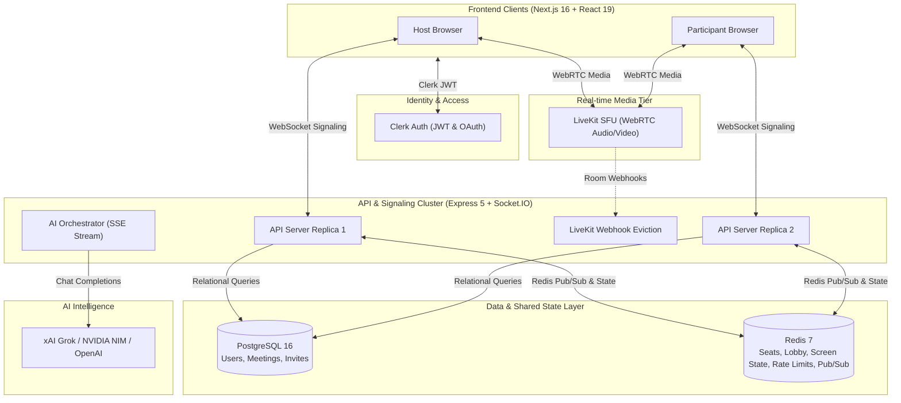

# Zylo 🎥

> **Host-controlled video meeting platform with real-time media, AI room intelligence, and live multilingual translation.**

Zylo is an enterprise-ready video collaboration platform engineered for high performance, strict host moderation, and intelligent meeting assistance. Built with Next.js, Express, LiveKit SFU, Redis, and PostgreSQL, Zylo scales effortlessly to group video calls with shared streaming AI and sub-second multilingual speech translation.

---

## 🌟 Product Highlights & Activities

Zylo is organized into focused, branded activity modules:

| Module | What It Does |
|---|---|
| **ZyloCall** | Instant one-click meeting creation with immediate room entry and shareable invite codes. |
| **ZyloMeet** | Schedule meetings in advance, manage upcoming/previous meeting rosters, and send calendar invites. |
| **ZyloRoom** | The in-meeting experience: adaptive video grid (from 320px mobile to 4K desktop), waiting lobby queue, camera/mic preview, and race-safe seat management. |
| **ZyloLive** | Host-governed screen sharing enforcing one presenter at a time with instant presenter handoff. |
| **ZyloChat** | Ephemeral in-meeting room chat with persistent last-20-line context window. |
| **Translator Convo** | Real-time dual-speaker captions and spoken translation across 18 languages (Indian & international), combining Web Speech API with cached fallback. |
| **Zylo AI & Nudges** | Shared AI room participant (OpenAI / Grok / NVIDIA NIM compatible) that streams answers simultaneously to all participants, plus proactive nudges when users are stuck or the room falls silent. |

---

## 🏗️ System Architecture

Zylo cleanly decouples real-time signaling, media routing, shared state, and AI execution:



### Architectural Pillars

1. **Signaling vs. Media Decoupling**: Video and audio flow directly through LiveKit's WebRTC SFU with speaker-focused subscription (only active speakers stream video, conserving bandwidth). Signaling and chat run over Socket.IO.
2. **Distributed Room State in Redis**: Meeting state (admitted participants, lobby queues, screen-share locks, and rate limits) lives in Redis, allowing seamless horizontal scaling across multiple API replicas.
3. **Zero-Downtime Redeploy Failover**: Server instances handle `SIGTERM` gracefully by marking seat grace periods in Redis and draining connections, enabling users to reconnect to alternate servers without dropping the video call or being sent back to the lobby.
4. **LiveKit Webhook Guard**: Unauthorized participants attempting to bypass room admission are kicked immediately via automated LiveKit webhooks.

---

## 🛠️ Technology Stack

| Layer | Technologies |
|---|---|
| **Web Frontend** | Next.js 16 (App Router), React 19, TypeScript, Tailwind CSS v4, shadcn/ui, Lucide Icons |
| **Signaling & API** | Node.js 22, Express 5, Socket.IO 4.8 (`@socket.io/redis-adapter`) |
| **Media (WebRTC SFU)** | LiveKit (`livekit-client` 2.22, `livekit-server-sdk` 2.19, `livekit-server`) |
| **Authentication** | Clerk (`@clerk/nextjs` 7, `@clerk/express` 2) |
| **Database** | PostgreSQL 16 (with connection pooling via `pg` 8) |
| **Shared State & Cache**| Redis 7 (`ioredis` 5) with cluster-safe atomic operations |
| **AI Engine** | OpenAI-compatible API (xAI Grok `grok-4.3`/`grok-4.7`, NVIDIA NIM Llama 3.2, or OpenAI) |
| **Testing** | Node test runner (`node:test`), comprehensive load test harness (`scripts/load-check.js`) |

---

## 🚀 Getting Started Locally

### Prerequisites

- **Node.js**: v22+
- **Docker**: For local PostgreSQL and Redis
- **LiveKit Server**: `brew install livekit` (macOS) or Docker
- **Clerk Account**: Free application created on [clerk.com](https://clerk.com)

### 1. Clone & Install Dependencies

```bash
git clone https://github.com/sahilsahanioffical18-ship-it/zylo-main.git
cd zylo-main

# Install server & web packages
npm --prefix server install
npm --prefix web install
```

### 2. Start Local Databases & LiveKit SFU

```bash
# Start PostgreSQL & Redis containers
npm run db:up

# Start local LiveKit developer server (in a separate terminal)
npm run livekit
```

### 3. Configure Environment Variables

```bash
cp server/.env.example server/.env
cp web/.env.local.example web/.env.local
```

Edit `server/.env` and `web/.env.local` to paste your Clerk API keys (`pk_test_...` and `sk_test_...`).

### 4. Run the Development Servers

```bash
# Terminal 1: Start API Server (http://localhost:4000)
npm run dev:server

# Terminal 2: Start Web Application (http://localhost:3000)
npm run dev:web
```

---

## 🧪 Testing & Load Verification

Zylo includes comprehensive unit, integration, and load tests:

```bash
# Run server test suite (runs against zylo_test database)
npm --prefix server test

# Run frontend unit tests and type checks
npm --prefix web test
npm --prefix web run build

# Run 20-participant multi-server load simulation
npm --prefix server run load-check
```

See [`LOAD_TEST_RESULTS.md`](LOAD_TEST_RESULTS.md) for benchmark metrics on memory, CPU, and zero-downtime failover latency.

---

## 🌐 Production Deployment

Zylo is designed to deploy entirely on free or managed cloud tiers:

- **Frontend**: [Vercel](https://vercel.com) (Root directory: `web`)
- **Backend API**: [Railway](https://railway.com) or [Render](https://render.com) (Root directory: `server`)
- **Media SFU**: [LiveKit Cloud](https://cloud.livekit.io) (Free 50 GB/mo tier)
- **Databases**: [Neon](https://neon.tech) (PostgreSQL) & [Upstash](https://upstash.com) (Redis)
- **Authentication**: [Clerk](https://clerk.com)

Detailed step-by-step instructions, environment configs, and webhook setups are documented in [`docs/deploy.md`](docs/deploy.md).

---

## 📁 Repository Structure

```text
zylo-main/
├── server/                     # Backend Express & Socket.IO signaling service
│   ├── app.js                  # Express application & HTTP endpoints
│   ├── server.js               # Server bootstrap, Socket.IO & Redis adapter
│   ├── db/schema.sql           # PostgreSQL table schemas
│   ├── lib/
│   │   ├── ai.js               # Grok / OpenAI / NVIDIA NIM streaming client
│   │   ├── auth.js             # Clerk authentication middleware & socket auth
│   │   ├── livekit.js          # LiveKit token generation & room management
│   │   ├── nudge.js            # Proactive AI nudge detection heuristics
│   │   ├── room.js             # Room state machine, events & host controls
│   │   ├── roomStore.js        # Redis-backed distributed room storage
│   │   ├── shutdown.js         # Graceful zero-downtime draining & failover
│   │   └── webhook.js          # LiveKit security eviction webhooks
│   ├── scripts/load-check.js   # 20-client multi-server load test script
│   └── test/                   # Comprehensive node:test suite
├── web/                        # Frontend Next.js App Router application
│   ├── app/                    # Next.js App Router pages (landing, dashboard, room)
│   ├── components/             # Reusable UI & meeting components (shadcn/ui)
│   │   ├── pre-join.tsx        # Camera/mic preview & audio test
│   │   ├── room-shell.tsx      # Main meeting room container & layout
│   │   ├── video-stage.tsx     # Adaptive responsive video grid
│   │   ├── control-bar.tsx     # Responsive meeting controls
│   │   ├── chat-panel.tsx      # ZyloChat & Ask AI interface
│   │   └── captions-panel.tsx  # Translator Convo live captions feed
│   └── lib/                    # React hooks, speech translators & room clients
├── docs/                       # Architecture specifications & deployment runbooks
├── docker-compose.yml          # Local PostgreSQL & Redis services
└── livekit.dev.yaml            # Local LiveKit SFU configuration
```

---

## 📄 License

Private & Proprietary. All rights reserved.
