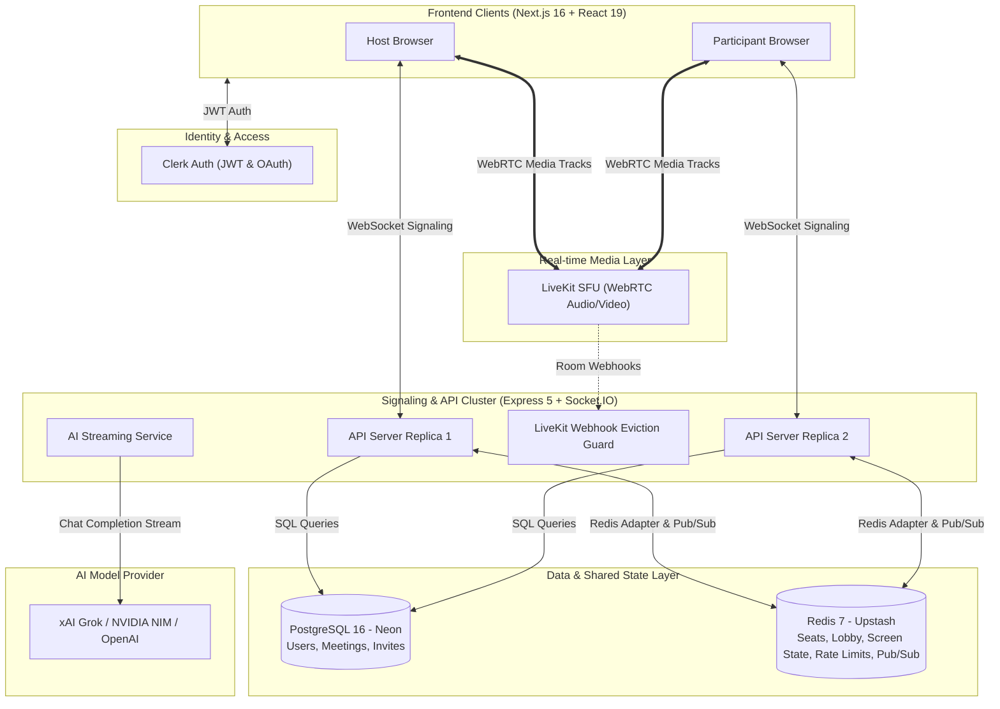

# Zylo — Comprehensive Project & System Architecture Master Guide

> **Document Purpose:** Complete knowledge base and technical deep-dive for **Zylo**, designed for system design review, technical interviews, resume prep, and AI prompt context.
> **Live Web App:** [https://zylo-web-two.vercel.app](https://zylo-web-two.vercel.app)  
> **GitHub Repository:** [https://github.com/sahilsahanioffical18-ship-it/zylo-main](https://github.com/sahilsahanioffical18-ship-it/zylo-main)

---

## 1. Executive Summary & Elevator Pitch

**Zylo** is a host-controlled, distributed video collaboration platform with real-time media, intelligent room assistance, and live multilingual speech translation. 

Unlike conventional meeting tools that treat AI as a private side-panel assistant, Zylo treats **AI as a shared participant in the room**—every person on the call sees identical streaming responses concurrently. Zylo also features **Translator Convo**, allowing two people speaking different languages (across 18 supported Indian and global languages) to converse in real time with spoken translation and synchronized live captions.

### Key Performance & Scale Metrics
- **Room Capacity:** Up to 20 seated participants per room with race-safe lobby queue.
- **Media Optimization:** Selective speaker-view video subscription (only the active speakers consume downstream video bandwidth; other participants receive audio and avatars).
- **Redeploy Resilience:** Zero-downtime graceful draining (`SIGTERM` handler)—server redeploys migrate active participants to another replica within 150 ms without dropping video calls or kicking users to the lobby.
- **Latency Benchmark:** 95th-percentile in-meeting chat delivery under 35 ms in multi-server load tests.

---

## 2. Product Modules & Branded Features

| Activity Name | Product Feature | Technical Implementation |
|---|---|---|
| **ZyloCall** | Instant 1-click meeting | Creates an ad-hoc room with a human-readable 10-char code (e.g., `xdo-wdit-nvm`), enters immediate host admission, and outputs copyable invite links. |
| **ZyloMeet** | Scheduled meetings & dashboard | Dashboard interface displaying **Upcoming**, **Previous**, and **Live** meetings; invite participant emails; backed by PostgreSQL relational records. |
| **ZyloRoom** | The in-meeting stage & lobby | Pre-join page with local device camera/mic preview; responsive adaptive video grid (fluidly adjusts from 320px mobile to 4K desktop); race-safe host admission lobby. |
| **ZyloLive** | Moderated screen sharing | Server-enforced single-presenter state machine. The host can grant, revoke, or force-stop screen shares; unauthorized shares are rejected server-side. |
| **ZyloChat** | Ephemeral meeting chat | Room-scoped text chat with real-time Socket.IO broadcasts and 20-message circular memory buffer used as context for AI. |
| **Translator Convo** | Dual-speaker live translation | Real-time speech recognition (Web Speech API) + cached machine translation fallback (Google / MyMemory) + speech synthesis across 18 languages, with headphones loopback mode. |
| **Zylo AI & Nudges** | Shared AI participant & Stuck Detector | Single LLM completion stream (OpenAI / xAI Grok / NVIDIA NIM) broadcasted via Server-Sent Events/WebSockets to all participants simultaneously. Proactive nudges fire when someone types "I'm stuck" or after 60s of awkward silence. |

---

## 3. High-Level Architecture Diagram

---

## 4. Architectural Deep Dive & Design Decisions

### 1. Separation of Media and Signaling
- **Signaling Channel:** Pure WebSocket via Socket.IO handles admission requests, lobby queue updates, chat, screen share locks, and AI text streaming.
- **Media Channel:** WebRTC audio and video flow directly to the **LiveKit SFU (Selective Forwarding Unit)**. 
- **Rationale:** Video/audio processing never traverses the Node.js event loop. A network blip or high CPU usage on the signaling server never degrades active video and audio quality.

### 2. Speaker-View Video Subscriptions
- Rather than a full-mesh topology (which consumes $O(N^2)$ bandwidth) or forwarding all 20 video streams ($20 \times 20 = 400$ streams), Zylo's client dynamically subscribes only to active speakers detected by LiveKit's Voice Activity Detection (VAD).
- Non-speaking participants default to audio-only with lightweight visual avatars, saving massive client bandwidth and battery.

### 3. Distributed State with Redis
- When multiple API servers run behind a load balancer, client sockets land on different servers.
- **State in Redis:** Room presence, seats, lobby queues, screen-sharing ownership, rate-limit counters, and translation audio caches live in Redis.
- **Pub/Sub Adapter:** Socket.IO uses `@socket.io/redis-adapter` so an event emitted on Server 1 broadcasts instantly to sockets connected to Server 2.

### 4. Zero-Downtime Deployment & Graceful Drain
- During redeployments (`SIGTERM` received by Node.js):
  1. The server stops accepting new connections immediately (`HTTP 503` on new requests).
  2. The server stamps active participant seats in Redis with a 30-second `graceUntil` timestamp.
  3. All pending AI streams finish and connections are closed with `transport close`.
  4. The client's Socket.IO auto-reconnects to the newly deployed replica within ~140 ms.
  5. The new replica inspects Redis, sees the valid `graceUntil` token, and immediately re-admits the participant into their existing seat without kicking them to the waiting lobby or dropping their WebRTC video call.

### 5. Webhook Eviction Security Guard
- A LiveKit media token can outlive a revoked seat by up to 10 minutes.
- To prevent unauthorized users who were removed or denied from lingering in the media room, LiveKit Cloud emits a `participant_joined` webhook to `POST /livekit/webhook`.
- The API verifies the cryptographic webhook signature, checks Redis for an active seat, and immediately evicts (`roomService.removeParticipant`) anyone who joins without a valid seat.

---

## 5. Technology Stack & Choices

| Tier | Technology | Why It Was Chosen |
|---|---|---|
| **Frontend Framework** | Next.js 16 (App Router), React 19, TypeScript | Server Components for instant initial load, App Router for clean layout persistence across routes. |
| **Styling & UI** | Tailwind CSS v4, shadcn/ui, Lucide Icons | Utility-first styling with accessible Radix primitives and modern custom tokens. |
| **Signaling & Backend** | Node.js 22, Express 5, Socket.IO 4.8 | Asynchronous event loop tailored for low-latency WebSocket signaling. |
| **Media SFU** | LiveKit Cloud & SDKs | WebRTC SFU with adaptive bitrate, simulcast, and automatic NAT traversal (STUN/TURN). |
| **Authentication** | Clerk (`@clerk/nextjs`, `@clerk/express`) | Complete OAuth (Google) and email authentication with short-lived JWT token validation. |
| **Relational Database** | PostgreSQL 16 (Neon Serverless) | Persistent ACID relational storage for user profiles, meetings, and participant records. |
| **In-Memory Cache & State** | Redis 7 (Upstash Serverless) | Atomic distributed locks, session persistence, rate-limiting counters, and Pub/Sub. |
| **AI Streaming** | OpenAI-Compatible API (NVIDIA NIM / xAI Grok) | Server-Sent streaming completions broadcast to all clients in real time. |
| **Hosting & Infra** | Vercel (Web) + Railway (API) | Managed cloud deployment with automatic CI/CD, SSL, and horizontal scaling. |

---

## 6. The 10-Phase Evolution of Zylo

1. **Phase 1: Foundation (Sep 17)** — Sign-in via Clerk, landing page, responsive dashboard for upcoming/past/live meetings, meeting creation API, pre-join video preview.
2. **Phase 2: Admission (Sep 19)** — Server-controlled seats (max 20), first-come lobby queue, host admission policies (manual/auto), and reconnect grace period.
3. **Phase 3: Live Meetings (Sep 21)** — LiveKit SFU integration, media tokens issued only to admitted seats, speaker-focused subscriptions, in-room **ZyloChat**.
4. **Phase 4: Host Controls (Sep 23)** — Host moderation (mute participant, remove user, stop screen share, end for all), **ZyloLive** single-presenter screen share, and LiveKit webhook security eviction.
5. **Phase 5: UI Polish (Sep 23)** — Adaptive video stage layout (auto-sizing grid for 1 to 20 users), mobile single-row control bar, chat toast previews, "Mute for me".
6. **Phase 6: Translator Convo (Sep 30)** — Dual-speaker live subtitles and speech translation across 18 languages, browser Web Speech API + Google TTS API fallback, audio loopback.
7. **Phase 7: Redis & Rate Limiting (Oct 2)** — Room state moved to Redis, `@socket.io/redis-adapter` for multi-server clusters, IP and user rate limiting, safe Redis degradation handling.
8. **Phase 8: Zylo AI (Oct 4)** — **Ask AI** button: streaming responses sent simultaneously to everyone in the room, 20-message chat context buffer, host toggle.
9. **Phase 9: AI Nudges (Oct 5)** — Proactive stuck detection heuristics (triggers on phrases like "I'm stuck" or 60s of silence), explanation tags, host activation.
10. **Phase 10: Production Readiness (Oct 6)** — Zero-downtime graceful shutdown, WebSocket-only transport enforcement, structured JSON logging, 20-client load test.

---

## 7. Key Technical Interview Questions & Answers

### Q1: Why did you separate signaling and media instead of routing everything through Node.js?
> **Answer:** Routing WebRTC video and audio through a Node.js process causes heavy CPU consumption and garbage collection spikes, which degrades WebSocket latency and causes audio jitter. By decoupling signaling (Node.js + Socket.IO) from media (LiveKit SFU written in Go/Rust), the API only relays lightweight control payloads (under 1 KB), while media packets stream over UDP directly through the SFU.

### Q2: How do you prevent race conditions when two participants try to take the last seat?
> **Answer:** In a multi-server setup, in-memory checks fail due to distributed state. We use atomic Redis transactions (Lua scripts / Redis sets) to enforce seat capacity. The admission check and seat assignment execute as a single atomic operation; if the count reaches 20, subsequent requests are automatically pushed to the Redis lobby queue.

### Q3: How does Zylo survive zero-downtime server redeploys without dropping meetings?
> **Answer:** When an API instance receives `SIGTERM`, our graceful shutdown handler runs:
> 1. Sets a 30-second `graceUntil` expiration on all active seats in Redis.
> 2. Sends `transport close` to all connected sockets.
> 3. WebRTC media on LiveKit continues uninterrupted because the SFU is independent.
> 4. Socket.IO clients automatically reconnect to a healthy server replica, which reads Redis, validates the `graceUntil` status, and seamlessly restores room presence in under 150 ms without kicking users to the lobby.

### Q4: How is "Ask AI" shared across all room participants?
> **Answer:** Rather than each user running their own private chat panel, when a user asks the AI a question, the server queries the LLM with the last 20 chat messages as context. As tokens stream back from the model, the server broadcasts `ai:chunk` events across the Socket.IO room, allowing everyone to watch the same streaming response simultaneously.

---

## 8. Resume Bullet Points

- **Architected and shipped Zylo**, a full-stack, host-moderated video collaboration platform using Next.js 16, Express 5, LiveKit SFU, Redis, and PostgreSQL deployed on Vercel and Railway.
- **Engineered distributed room state and clustering** via Redis and Socket.IO Redis Adapter, supporting horizontal API scaling and sub-35ms in-room messaging latency.
- **Implemented zero-downtime graceful shutdown mechanics** with Redis seat grace periods, ensuring active video calls migrate across server redeployments in <150 ms.
- **Built "Translator Convo"**, an automated dual-speaker speech-to-text, translation, and text-to-speech pipeline supporting 18 languages with Web Speech API and cached API fallbacks.
- **Designed shared AI room participant and proactive stuck-detection heuristics** that analyze chat context and stream AI assistance concurrently to all participants via WebSockets.
- **Automated load testing up to 20 concurrent participants** across clustered replicas, validating zero packet loss, zero dropped chat messages, and atomic seat admission.
